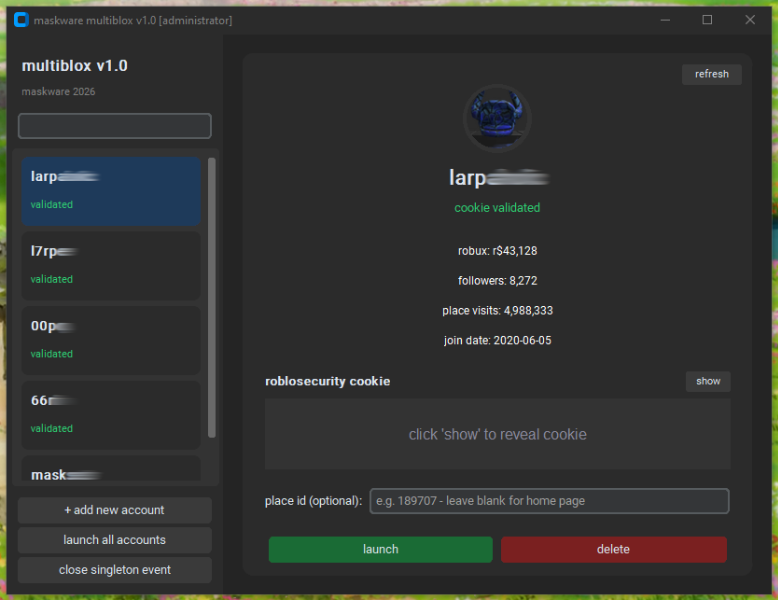

# multiblox v1.0
**maskware 2020 - 2026**

multiblox by maskware is an open source roblox multiple instance account manager python script for windows. store multiple accounts, switch between them instantly and launch multiple roblox clients simultaneously.



---

## features

- **multiple instances** - bypass roblox's singleton lock and run as many instances as you want at the same time
- **account management** - store multiple accounts with cookies
- **instant switching** - auth tickets are fetched per-launch so each instance authenticates independently
- **account stats** - view robux balance, follower count, place visits and join date per account
- **place id launching** - optionally launch directly into a specific game by place id
- **cookie validation** - cookies are verified against the roblox api on launch and refresh
- **secure cookie storage** - cookies are xor-obfuscated before being written to `accounts.json`

---

## requirements

- windows 10 or 11
- python 3.10+
- roblox installed via the standard launcher

install dependencies:

```
py -m pip install customtkinter requests pillow
```

---

## installation

1. download `multiblox.py`
2. install the dependencies above
3. right-click `multiblox.py` -> **run as administrator** (required for multi-instance)
4. add your accounts and launch

`accounts.json` will be created in the same folder as the python script.

---

## how to get your roblosecurity cookie

1. open roblox.com in your browser and log in
2. press `f12` to open devtools
3. go to **application** -> **cookies** -> `https://www.roblox.com`
4. find `.ROBLOSECURITY` and copy the value
5. paste it into the add account popup in multiblox

> **never share your .roblosecurity cookie.** anyone who has it can log into your account.

---

## usage

| action | how |
|---|---|
| add account | click `+ add new account`, paste cookie |
| launch single account | click account -> `launch` |
| launch all accounts | click `launch all accounts` |
| reorder accounts | drag and drop in the list |
| refresh stats / recheck cookie | click `refresh` on the account page |
| close singleton manually | click `close singleton event` |
| reveal cookie | click `show` on the account page |

---

## how multi-instance works

roblox uses a windows named event (`ROBLOX_singletonEvent`) to prevent more than one client from running at a time. multiblox uses `NtQuerySystemInformation` to enumerate all kernel handles system wide, finds the ones belonging to roblox processes and closes them remotely using `DuplicateHandle` with `DUPLICATE_CLOSE_SOURCE`. once the event is destroyed a new roblox process can start. each account gets its own auth ticket fetched from `auth.roblox.com` and passed directly in the launch url so each instance logs into the correct account independently.

this requires **administrator privileges** to open handles in other processes.

---

## files

```
multiblox.py  - the python script
accounts.json - the account cookies and stats (created automatically)
```

---

## disclaimer

this tool is intended for use with accounts you own. please use responsibly and in accordance with roblox's terms of service. i am not liable for any moderation actions taken after using my script.

---

## special thanks

**claude** - put up with me calling them not so nice names after nuking my code every prompt.
